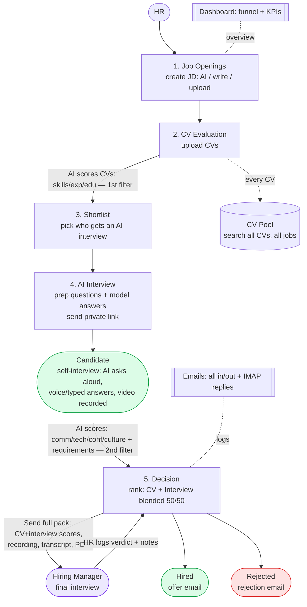

# Diyar HR — System Summary & Flow

A one-page description of the whole product, written so you can paste it into
Claude / ChatGPT (or an image model) to generate a flow diagram. The last
section is a ready-to-use **image-generation prompt**.

---

## 1. What it is (one line)

**Diyar HR** is a **fully local, AI-assisted hiring pipeline**: an HR
user drives the whole process from one web app — post a job, let AI screen the
CVs, shortlist, have candidates self-interview with an AI interviewer, then
combine both signals to make the final hire decision. Nothing runs in the cloud;
everything is on the HR laptop.

## 2. Who's involved (3 actors)

- **HR** — drives the pipeline (posts jobs, screens, shortlists, decides).
- **Candidate** — applies (CV), then self-interviews via a private link.
- **Hiring Manager (HM)** — receives a hand-off pack and weighs in on the final call.

## 3. The end-to-end flow (the pipeline)

Each numbered step is a tab in the app. 🤖 = AI step, ✉ = email sent.
**Key principle: automated screening filters the pool BEFORE the hiring manager
spends any time — the manager only sees a tiny, already-screened shortlist.**

1. **Job Openings** — HR creates the role and job description (AI-generated, written, or uploaded file). Job becomes "open".
2. **CV Evaluation** (4-step wizard: pick job → set criteria → upload CVs → run) — 🤖 AI scores every CV and produces an **overall score + skills / experience / education** breakdown, strengths, and weaknesses. *(First filter.)*
3. **Shortlist** — HR decides **who gets an AI interview** (**Shortlist ✓ / Reject ✗**). This is the gate into the interview, not a hiring-manager hand-off.
4. **AI Interview** — HR prepares questions (from a bank, AI-generated, or written, each with optional **model answers**), then sends the candidate a **private interview link**. The candidate **self-interviews**:
   - 🤖 the AI **asks questions aloud** (text-to-speech),
   - the candidate **answers by voice** (speech-to-text) or by **typing** (fallback),
   - the session is **video-recorded**,
   - on submit, 🤖 AI **scores the answers**: communication · technical · confidence · culture-fit, plus **requirements met** (salary / iqama-visa / notice period / location). *(Second filter.)*
5. **Decision** — the hub for the final call, in order:
   - **Rank**: CV score and interview score shown side by side and **blended into one ranked list** (adjustable 50/50 weighting slider).
   - **Send to Hiring Manager** ✉ — for the top few, HR sends the **full package**: CV scores + interview scores + AI strengths/weaknesses + requirements + **recording + transcript + PDF report**. *(The HM hand-off happens HERE — after both automated filters — not before.)*
   - The **hiring manager runs the final interview** offline; **HR logs the manager's verdict + notes** back into the candidate's row.
   - HR makes the final call: **Hire ✓ · Send Offer ✉ · Reject ✗**.

Per-candidate status flows: **Ranked → Sent to HM → HM reviewed → Hired / Rejected**.
Outcome: **Hired** (→ offer email) or **Rejected** (→ rejection email).

## 4. Supporting layers (around the pipeline, not steps)

- **Dashboard** — always-on overview: hiring funnel (applied → evaluated → shortlisted → interviewed → hired) and KPIs across all jobs.
- **CV Pool** — every CV ever uploaded is **searchable forever, across all jobs** (Ctrl-F-style keyword search; pull any candidate by a skill at any time, interviewed or not).
- **Emails** — a log of **every message in and out**: offers, rejections, shortlist notices, interview invites, HM packs — **and candidate replies pulled back in via IMAP** (threaded to the original message).

## 5. AI touchpoints (all local, Ollama `qwen3:4b`)

- Job-description generation
- Evaluation-criteria generation
- CV scoring (skills / experience / education)
- Interview question generation
- Interview answer scoring + requirement extraction

## 6. Behind the scenes (tech stack, all local)

```
React + Vite UI  ─▶  n8n workflows (webhook API)  ─▶  PostgreSQL  (all hiring data)
                                                   ├▶  Ollama qwen3:4b  (AI)
                                                   ├▶  SMTP sidecar  (outbound email)
                                                   ├▶  IMAP sidecar  (inbound replies)
                                                   └▶  Recording server (interview videos)
```

## 7. ASCII flow (reference shape for the diagram)

```
        ╔══════════════════════════════════════════════════════╗
        ║  DASHBOARD — live hiring funnel & KPIs (all jobs)     ║   ◀ always-on
        ╚══════════════════════════════════════════════════════╝
 HR
  │
  ▼
① JOB OPENINGS ─▶ ② CV EVALUATION ─▶ ③ SHORTLIST ─▶ ④ AI INTERVIEW ─▶ ⑤ DECISION ───────────────▶ HIRED / REJECTED
   create JD          🤖 score CVs        pick who gets    👤 self-interview    rank (blend CV+interview)   (offer /
   AI/write/upload    skills·exp·edu      an AI interview  TTS ask · STT/type   then ✉ SEND FULL PACK TO    rejection
                          │               (1st filter →    answer · 🎥 record   HIRING MANAGER (CV+intv     email ✉)
                          │                shortlist/reject)🤖 score comm·tech·  scores+recording+transcript
                          ▼                                 conf·culture + reqs  +PDF) → 🧑‍💼 HM final interview
                    🔎 CV POOL                              (salary/iqama/…)     → HR logs verdict → Hire/Reject
                    (search all CVs,                        (2nd filter)
                     every job, forever)

        ╔══════════════════════════════════════════════════════╗
        ║  EMAILS — every message in/out logged (IMAP replies) ║
        ╚══════════════════════════════════════════════════════╝

  ▶ The hiring manager enters only at stage ⑤, AFTER both automated filters,
    and sees the full screening package — never raw, unfiltered applicants.
```

## 8. Mermaid version (renders directly in GitHub / many viewers)



---

## 9. 📋 IMAGE-GENERATION PROMPT (copy-paste this)

> Create a clean, modern **horizontal flowchart** titled **"Diyar HR — Hiring Flow"** in a corporate style with a primary blue (#2563eb) accent on a light background.
>
> Show a **left-to-right pipeline of 5 main stages** as rounded rectangles connected by arrows:
> **1) Job Openings** → **2) CV Evaluation** → **3) Shortlist** → **4) Interview** → **5) Decision**, ending in two outcome chips: **Hired** (green) and **Rejected** (red).
>
> Under each stage, a short caption:
> - Job Openings: "Create job + JD (AI / write / upload)"
> - CV Evaluation: "AI scores each CV — skills, experience, education"
> - Shortlist: "Pick who gets an AI interview (1st filter passed)"
> - Interview: "Candidate self-interviews — AI asks aloud, voice/typed answers, video recorded; AI scores answers + requirements (2nd filter)"
> - Decision: "Rank (blend CV + interview) → send full pack to Hiring Manager → HM final interview → Hire / Offer / Reject"
>
> Mark AI steps (CV scoring, interview question generation, interview scoring) with a small **robot/AI badge**; mark email steps (HM pack, offer, rejection) with an **envelope icon**.
>
> Use **three actor lanes / colored tags**: HR (blue) drives stages 1,2,3,5; Candidate (green) is the Interview self-interview; **Hiring Manager (purple) appears ONLY at stage 5 (Decision) — after both automated filters — receiving the full screening package (CV + interview scores + recording + transcript) for the final interview.** Emphasize visually that the manager enters late, on a small filtered set, never on raw applicants.
>
> Around the pipeline, show **three always-on supporting blocks** connected with dashed lines: a **Dashboard** banner on top ("funnel + KPIs"), a **CV Pool** cylinder/database below CV Evaluation ("search all CVs across every job, forever"), and an **Emails** banner at the bottom ("every message in/out, incl. candidate replies").
>
> At the very bottom, a thin tech-stack strip: "React UI → n8n → PostgreSQL · Ollama (local AI) · SMTP/IMAP · Recording server — 100% local."
>
> Style: flat, professional, generous white space, rounded corners, subtle shadows, clear arrows, legible sans-serif labels.

---

*Tip: paste Section 9 for a quick image, or paste Sections 1–6 if the tool wants
full context first. The Mermaid block (Section 8) renders as a diagram on GitHub
without any image model.*
